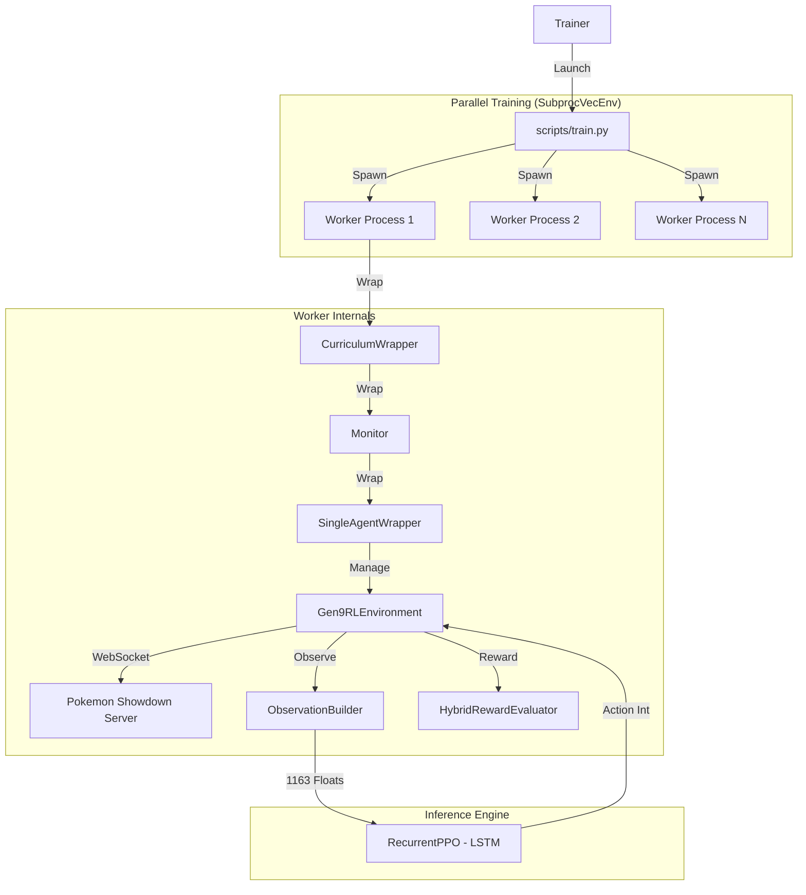

# System Architecture 🏗️

## 1. High-Level Diagram



## 2. Core Components

### A. `Gen9RLEnvironment` (`src/environment.py`)
Custom Gymnasium environment bridging Python and Pokemon Showdown.
- **Parallelism**: `SubprocVecEnv` bypasses GIL; each worker has its own Showdown connection
- **CurriculumWrapper**: Middleware for curriculum updates (`set_progress()`, `swap_opponent()`)
- **Team Rotation**: Uses `Teambuilder` objects for per-game team generation

### B. `BeliefTracker` (`src/belief_tracker.py`)
Bayesian inference engine for hidden information.
- **Input**: Moves used, damage taken, item/ability activations
- **Update**: `P(Choice Scarf | outsped)`, move set probabilities
- **Output**: Probability distributions fed into observation vector

### C. `HybridRewardEvaluator` (`src/rewards/hybrid.py`)
Delta-based reward shaping with curriculum phases.
- **Components**: HP delta, fainted count, matchup advantage, hazards, boosts
- **Phases**: EARLY (damage focus), MID (strategy), LATE (winning)
- See [Reward System](rewards.md) for full specification

### D. `ObservationBuilder` (`src/embeddings.py`)
Encodes battle state into neural network input.
- **Encoders**: Active, Team, Moves, Matchup, Field, Belief, Meta
- **Output**: 1163-dim float vector
- See [Observation Space](observations.md) for full breakdown

### E. `OpponentPoolManager` (`src/curriculum_agents/opponent_pool.py`)
AlphaStar-style opponent selection.
- **Tiers**: Tutorial, Tactical, Strategic, Self-Play
- **Agents**: 10 heuristic bots + frozen checkpoints
- See [Curriculum Agents](curriculum_agents.md) for details

## 3. Wrapper Stack (Inner → Outer)

```
Gen9RLEnvironment (core battle logic)
    └─ SingleAgentWrapper (poke-env, manages opponent)
        └─ Monitor (stable-baselines3, logging)
            └─ CurriculumWrapper (hot-swap opponents, track wins)
```

## 4. Key Data Flows

| Flow | Path |
|------|------|
| **Action** | Policy → `ActionHandler.action_to_move()` → WebSocket → Showdown |
| **Observation** | Showdown → Battle object → Encoders → 1163 floats → Policy |
| **Reward** | Battle state delta → `HybridRewardEvaluator.calculate()` → scalar |
| **Curriculum** | `CurriculumCallback` → `OpponentPoolManager.sample_opponent()` → new agent |
